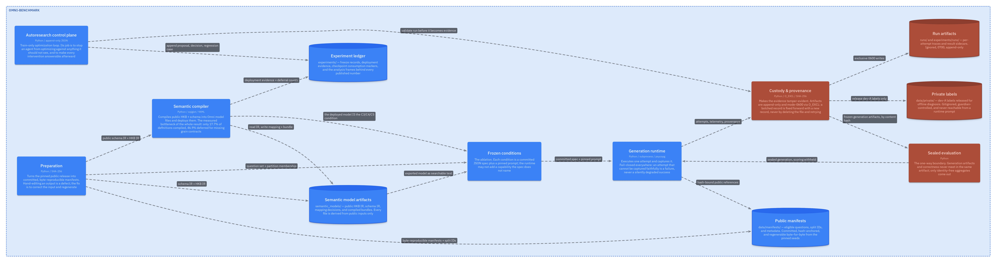
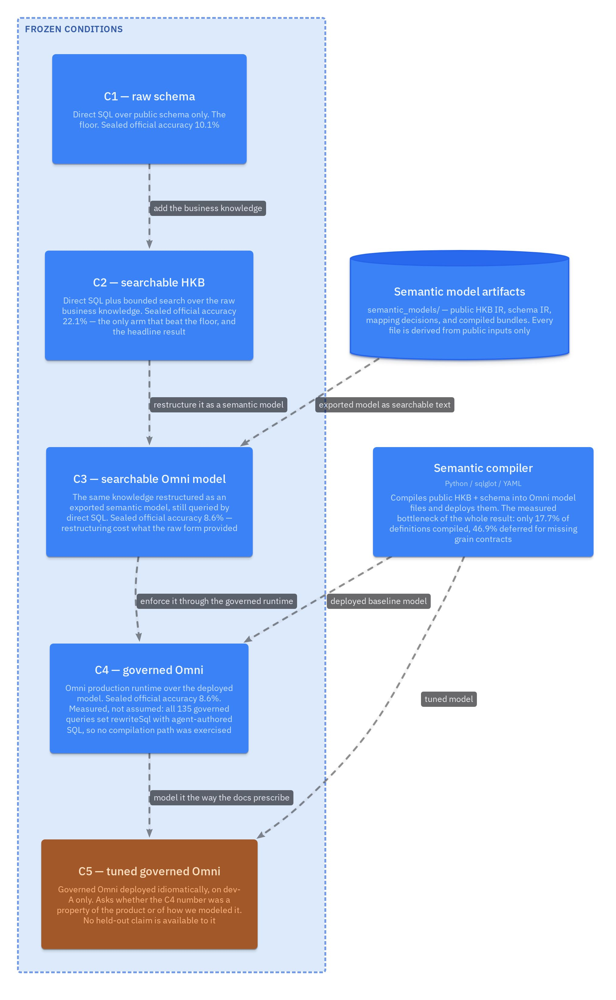
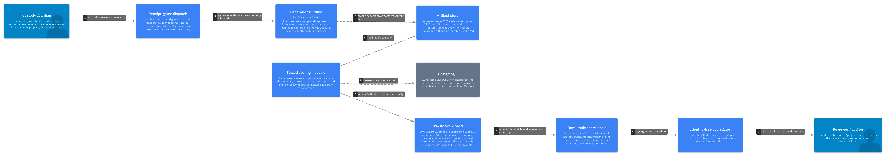

# Omni on LiveSQLBench Large-v1

[](https://github.com/sjarmak/omni-benchmark/actions/workflows/quality.yml)

> **Status.** The primary C1-C4 held-out evaluation is complete and frozen: 89
> questions, four conditions, three repetitions, 1,068 immutable attempts, both
> preregistered scorers. Those numbers are final. A mechanism analysis, C5, has
> since run on development data to test the *interpretation* of the C4 result:
> rebuilding the same product to its own documented shape doubles governed
> accuracy, 13.2% against 6.6% on the identical frame, while the agent kept
> writing the metric logic in SQL itself. C5 is a single-repetition development arm reported
> without an interval; it cannot change the held-out accuracy figures and makes
> no held-out claim. It was registered after the sealed aggregates were opened,
> which is exactly why it is confined to development data. See [what is still
> open](#what-is-still-open).

## The question

Omni's premise is that an AI agent gets more accurate when it answers through a
semantic model instead of writing SQL against a raw schema. This repository
tests that premise on a third-party benchmark, LiveSQLBench Large-v1, whose
databases each ship a knowledge base of interdependent business definitions.

The condition ladder comes out of [Where business meaning
lives](https://www.sjarmak.ai/library/explorers/where-business-meaning-lives), a
thematic explorer over 75 papers that separates what the literature treats as
one variable into three: the *knowledge* a schema leaves out, the
*representation* the model targets instead of SQL, and the *enforcement* that
makes a class of wrong answer unproducible. Its reading of the field is that
those three are argued from different papers, over different schemas, models,
and question sets, and then compared as though they were commensurable. Its
first open problem is the experiment that would fix that: four conditions over
one sealed question set, each adding a single ingredient. C1-C4 below are that
ablation. The explorer also supplies two of this repository's design
commitments, the metered holdout against adaptive-analysis drift and the two
frozen scorers that test whether evaluator normalization is doing the measuring.

**Business knowledge helped a great deal, and almost all of that value was lost
on the way into the executable semantic model.** The reasons are specific, and I
think they are actionable.

## How the benchmark is structured

The pinned public release has 480 tasks. Excluding the 148 `Management` tasks
leaves 332 analytical `Query` tasks. A deterministic, database-stratified split
assigns 231 to development and 101 to a sealed final evaluation, with all 18
databases present in both. Development splits again into 154 adaptive questions
(`dev-A`) and 77 metered checkpoint questions (`dev-B`, never consumed).

**The split was committed before the gold labels were requested.** Held-out gold
never entered the workspace; a separate custodian released development labels
only, and the sealed evaluator runs outside the development boundary. Scoring
compares result sets under two scorers that were both frozen in advance and are
both always reported, so no scorer was chosen after seeing an outcome.

The held-out frame is 89 of the 101 sealed questions, narrowed **before any
sealed generation, label release, or outcome access**, because the official
loader left required tables unavailable on two of the 18 databases. All four
conditions and all three repetitions use the identical 89. The result therefore
estimates performance on the 16 deployable databases, not the full benchmark.

## The condition ladder

Each rung adds exactly one ingredient to the rung below it.

| Condition | What it has | What it was meant to isolate |
| --- | --- | --- |
| **C1** | Raw schema, direct SQL | The floor: an agent with structure and no business meaning |
| **C2** | Raw schema + searchable business knowledge (HKB), direct SQL | Does the business knowledge itself help, in its native prose form? |
| **C3** | Compiled/exported semantic-model knowledge, direct SQL | Does that knowledge survive being turned into a structured model, when the agent still writes the SQL? |
| **C4** | The deployed Omni semantic model, answered through Omni's production agent | The product premise: governed semantic execution versus writing SQL yourself |
| **C5** | Omni deployed toward its documentation: every table published, full FK join graph, complete knowledge port into `ai_context`. No measures, `ai_fields`, `synonyms`, `sample_values`, or `sample_queries`, so it is a lower bound on the documented workflow, not a ceiling | *Development data only, not scored on the sealed split.* Was C4's result a property of the semantic layer, or of the sparse model we were able to compile? It was the sparse model: C5 doubles C4 on the identical frame, 13.2% against 6.6%. C5 also raised topic scoping from 69.6% to 98.5%, while the agent still hand-wrote aggregates on 38.1% of attempts because the compiled topics define no measures. |

**Where the design failed to isolate what it intended.** C4 was supposed to
separate semantic query composition from agent-written SQL. It did not. All 135
governed semantic queries return agent-authored SQL in `userEditedSQL`, and
while that SQL references the deployed model through `${view.field}` templating,
the agent writes the metric logic itself. Because the conservative compiler left
the deployed topics with no joins and no measures, no fully composed path existed for
cross-table access, and Omni's agent resolved model fields at rewrite time on
109 of 135 attempts. C4 measured Omni as a governed vocabulary, not as a query
compiler. C4 minus C3 is a system-level contrast between two conditions that
both author SQL. This is disclosed rather than repaired, in
[`docs/c4-query-path-disclosure.md`](docs/c4-query-path-disclosure.md).

## What I hill climbed on, and what it taught me

All optimization ran on `dev-A`, and none of it reached the sealed system. The
four sealed conditions are the untuned baseline: the supervised development phase
was cut before it ran, so C1 through C4 received no question-level supervision and
must not be described as tuned, adapted, or dev-A-supervised. The hill climbing
below produced the separately reported development arms, E02 and C5, which are
dev-A only. The full trajectory, including the experiments
that produced nothing, is [`docs/experiment-trajectory.md`](docs/experiment-trajectory.md);
the contemporaneous ledger of about 200 decisions is
[`docs/research-log.md`](docs/research-log.md). The condensed version:

| Hypothesis | Result | Decision |
| --- | --- | --- |
| The public HKB compiles into an executable semantic model | 193 of 1,090 definitions compiled (17.7%); 511 (46.9%) deferred across an unresolved grain | Ship the conservative compiler, carry the rest as searchable context |
| Unbounded schema retrieval makes the direct comparator unfair and unrunnable | A 51-table single response became a 4-table, 64 KiB bound | Freeze the bound as a disclosed scaffold |
| Business knowledge helps a direct-SQL agent | dev-A: C1 7.4%, C2 23.8%, C3 13.1% | Carry all three into the sealed run untuned |
| C4 minus C3 isolates semantic query composition | **Refuted.** All 135 parseable dev-A governed queries returned agent-authored SQL; the model supplied field resolution and, on 94 of 135, join scope, but never the metric | Amend the claim, disclose it, do not touch the data |
| E01: same-grain dependency composition is missing | Already in the baseline: 70 executable dependency edges, depth 3 | Audited no-op, contrast cancelled |
| E02: FK-backed relationships restore a composed join path | 91 relationships deployed; generation froze 117 answers and 19 capture failures | **INCONCLUSIVE** on the preregistered complete-136 rule; no promotion, no rerun |
| E05: typed output fields fix the 31 `UNKNOWN`-type contract failures | Preregistered precondition needed 16 of 31; the ceiling is 6 of 31 | **INCONCLUSIVE** by its own stopping rule, zero live attempts spent |
| C5: docs-idiomatic deployment carries C2's knowledge value into the governed path | dev-A: C5 13.2% against frozen C4 6.6% on 136 identical attempts, at 32% fewer median tokens; topic scoping rose to 132/134 and hand-written aggregates held at 38.1% | **Partly supported.** About a third of the C4-to-C2 gap closes on the matched frame (33% official, 27% sensitivity), entirely through context rather than composition |

Two of those are worth reading as research judgment rather than as results. The
refutation in row four is this study's own central design assumption falling to
its own telemetry, and everything after it exists because of that. E05 was
killed by a stopping rule checked against records that already existed, which
cost nothing and would otherwise have been an attractive intervention to run.

## The frozen held-out result

**These are the headline numbers. Nothing below this section can change them.**
Matched frame: 89 questions, 16 databases, 3 repetitions, 1,068 attempts. Both
frozen scorers, published together.

**Why 16 databases and not 18.** The pinned LiveSQLBench loader builds each dump
path as `<declared table>.sql` and matches filenames exactly. In two databases
the declared table names are mixed or upper case while the archive files are
lowercase, so the loader silently skips 34 of 55 tables in
`mental_healths_large` and 37 of 57 in `organ_transplant_large`. Gold SQL for
those databases then references tables that were never created, so both frozen
scorers fail on the gold statement itself and every one of their questions is
unscorable for any system. We cut them before generating a single sealed answer,
not after seeing results. The same bug was fixed twice in the Base loader; we
filed it against Large-v1 on 2026-08-29 as
[bird-bench/livesqlbench#10](https://github.com/bird-bench/livesqlbench/issues/10)
([full audit](docs/livesqlbench-upstream-loader-report-draft.md)).

| Condition | Official Soft EX | Corrected sensitivity |
| --- | ---: | ---: |
| C1: raw schema | 10.1% | 10.1% |
| **C2: raw schema + searchable HKB** | **22.1%** | **19.5%** |
| C3: exported semantic model | 8.6% | 8.6% |
| C4: governed Omni | 8.6% † | 9.7% † |

| Contrast | Official | 95% interval | Sensitivity | 95% interval |
| --- | ---: | ---: | ---: | ---: |
| C2 − C1 | **+12.0 pts** | 5.6 to 18.7 | **+9.4 pts** | 3.4 to 15.7 |
| C3 − C2 | −13.5 pts | −20.6 to −7.1 | −10.9 pts | −17.6 to −4.9 |
| C4 − C1 † | −1.5 pts | −7.1 to 4.1 | −0.4 pts | −6.4 to 5.6 |
| C4 − C3 † | 0.0 pts | −4.9 to 4.9 | +1.1 pts | −4.1 to 6.7 |

**† C4 is not a valid measure of governed semantic composition.** Every sealed
C4 query returned agent-authored SQL, and the compiled topics defined no
measures, so the metric logic was always written by the agent rather than
composed from the model. C4's 8.6% measures an agent writing SQL against a model
that supplied field references and, on roughly half of attempts, join scope, at
governed-path latency and cost. Read the
C4 rows as a measurement of that system, not of semantic composition. Audit the
counts yourself in
[`governed-query-path-tally-v1.json`](experiments/analysis/governed-query-path-tally-v1.json);
narrative detail in [`docs/c4-query-path-disclosure.md`](docs/c4-query-path-disclosure.md);
product consequence in [PF-016](docs/product-findings.md#pf-016-the-sql-authoring-pathway-is-not-surfaced-and-it-is-the-most-permissive-route).

What that table says, mechanism first:

- **193 of 1,090 public knowledge definitions compiled, 17.7%.** 511 of them,
  46.9%, were deferred because they crossed a grain the knowledge base never
  states. The executable model was built from a fifth of the available business
  semantics. This number is a joint property of the knowledge base and a
  compiler that refuses to guess: it emits no object whose grain, identity,
  cardinality, or aggregation the source fails to state, so the leading losses
  are `cardinality_unknown`, `aggregation_unspecified`, and
  `cross_grain_no_identity`, not missing vocabulary. A permissive compiler would
  emit more by inferring joins and aggregations, which is the thing a semantic
  layer exists to stop. A human modeler with domain access could raise it;
  nothing here measures how far.
- **No governed query composed a metric through the semantic model.** Across six
  governed arms, 661 of 661 parseable attempts returned agent-authored SQL. That
  SQL is not raw table SQL: it references the model through `${view.field}`
  templating on 660 of 661, and most attempts also take the model's join scope
  (69.6% of dev-A C4, 98.5% of C5). What the model never supplied is the metric.
  An aggregate hand-written over a field reference, which is Omni's documented
  signal that a topic lacks the measure a metric needs, appears on 34.1% of dev-A
  C4 and 38.1% of C5; a `FROM` naming a physical table appears on 26.0% to 33.0%.
  Per-arm counts, regenerable from public run metadata:
  [`experiments/analysis/governed-query-path-tally-v2.json`](experiments/analysis/governed-query-path-tally-v2.json)
  via [`governed_query_path_tally.py`](experiments/analysis/governed_query_path_tally.py).
  The superseded schema-1 artifact and the correction are recorded in D-211.
- **Widening the model sixfold moved accuracy and did not move the fallback.**
  C5 published a view for every table and a join for every qualifying foreign
  key. Governed accuracy doubled on the identical development frame, 13.2%
  against 6.6%, at roughly two-thirds the median token cost. Topic scoping rose
  from 69.6% to 98.5%, and the hand-written-aggregate rate did not fall. View
  sparsity was not what kept the governed path from composing metrics; the
  absent measures were, and better context is worth real accuracy on its own.
- **Better context bought accuracy and time at once.** On the matched
  development frame C5 answered 13 to C4's 5 while spending 29% less wall time on
  32% fewer median input tokens. Accuracy and resource use moved in the same
  favorable direction, which is the signature of a model that made the task
  easier rather than one that spent more effort on it. See
  [what it cost and how long it took](#what-it-cost-and-how-long-it-took).
- **C2 over C1 is the strongest result in the study, and it is a result about
  business semantics.** Searchable business knowledge, in raw prose form, is
  worth about 12 points to a direct-SQL agent, interval 5.6 to 18.7, excluding
  zero under both scorers. That is the measured size of the prize.
- **Almost none of those 12 points survive the trip into an executable model.**
  C3 gives back 13.5 points, and the loss happens during compilation, before
  Omni's runtime is involved at all.

Put together, the chain is compilation coverage and a silent runtime fallback,
not a verdict on the semantic-layer thesis. The 12 points are real and they are
sitting on the other side of a pipeline that captured a fifth of the semantics
and then routed around what it did capture.

C4 was also the most expensive condition: 3.9 times C1's median tokens, 1.5
times its latency, 2.3 times its tool calls, with no accuracy gain. It did have
the highest completion rate on the sealed frame, 229 of 267 attempts answered
(85.8%) against C1's 179 (67.0%), and its failures were concentrated in a
different place: 38 sealed attempts never reached a scoreable answer at all,
failing at validation or the result contract rather than returning a wrong
number. The development baseline is where those failures were classified, and
there the count is 34 of 136 after recovery.

## What it cost and how long it took

All five arms on the matched 122-question development frame, the only frame every
condition was scored on.

| Arm | Total USD | Median USD/attempt | Total wall time | Median latency | Median in/out tokens | Correct | USD per correct answer |
| --- | ---: | ---: | ---: | ---: | ---: | ---: | ---: |
| C1 direct, raw schema | $161.85 | $0.979 | 1.50 h | 35.7 s | 124,723 / 2,313 | 9 | $17.98 |
| C2 direct, searchable HKB | $181.99 | $1.191 | 1.69 h | 47.0 s | 155,056 / 3,143 | 29 | $6.28 |
| C3 direct, structured model | $195.07 | $1.012 | 1.89 h | 44.6 s | 143,867 / 3,067 | 16 | $12.19 |
| C4 governed, mechanical | $83.44 &dagger; | $0.684 &dagger; | 2.01 h | 50.6 s | 580,587 / 2,509 | 5 | $16.69 &dagger; |
| C5 governed, docs-idiomatic | $83.44 &dagger; | $0.684 &dagger; | 1.42 h | 31.9 s | 395,010 / 1,599 | 13 | $6.42 &dagger; |

&dagger; estimated, not measured.

**Wall time** is end-to-end per-attempt latency, complete in all five arms. A
total is the sum over the frame and describes work done, not elapsed clock:
attempts ran concurrently. C5 is the fastest arm in the study on both axes, and
C4 the slowest, on the identical questions and the identical governed surface.

**Dollar cost** is measured per attempt only for C1-C3, which bill through the
Claude Code OAuth surface. Omni's job endpoint exposes no price field, and the
harness pass that brackets Omni's AI credit counter around each attempt landed
after every run in this frame, so all 244 governed attempts record
`cost_source: unavailable`. The governed figures are instead the billing-period
credit total divided across the Omni-routed attempts on disk: $0.684 per attempt,
$0.904 as an upper bound. That is an arm-level estimate with no per-job
attribution, identical on every governed row, and it cannot separate a cheap
attempt from an expensive one. **Cost is not comparable between the direct and
governed arms**, and token volume is not a proxy for it: C4 used 3.9 times C1's
median tokens for roughly half the dollars, because the two arms bill through
different surfaces.

Per-arm sums, medians, and Tukey quartiles are generated, not hand-tallied, into
[`matched-122-cost-time-rollup-v1.json`](experiments/analysis/matched-122-cost-time-rollup-v1.json)
by
[`matched_122_cost_time_rollup.py`](experiments/analysis/matched_122_cost_time_rollup.py).
[RESULTS.md section 5](RESULTS.md#cost-and-wall-time-across-all-five-arms) states
how each column was measured.

### Browsing it per question

[`experiments/trace_viewer/`](experiments/trace_viewer/) builds a self-contained
condition explorer over the same frame: one row per question, five outcome cells,
and the arm rollup above the table recomputing under whatever filter is active.
Expanding a row gives, per arm, the submitted query, the returned rows, the step
trajectory with per-step tokens and timing, the retrieval and exploratory SQL the
attempt issued, and its cost, tokens, and wall time.

```bash
uv run python experiments/trace_viewer/build.py
```

That writes `experiments/trace_viewer/index.html`, which needs no server and no
network. It is gitignored: it is a 4MB build product that inlines the frame, and
it is regenerated from committed artifacts in a second.

Contrast chips pick out the comparisons worth reading. `only_C2` is the eight
questions only searchable prose solved; `C5_recovers_C4` is the seven the widened
model rescued; `all_wrong_with_errors` is the 46 no arm reached a scoreable
answer on.

## Why the result came out this way

Every step below is measured. The one causal link this chain originally asserted,
between a thin model and the runtime's behavior, was tested afterward and did not
hold, which is why it now appears as step 5 rather than as a connective.

1. **The knowledge is real and it helps.** C2 beats C1 by 12 points using
   nothing but searchable HKB prose.
2. **Most of it will not compile.** Of 1,090 public definitions, 193 (17.7%)
   became executable objects. 511 (46.9%) were deferred because they crossed a
   grain the source never states. The recorded blockers are unknown cardinality,
   unspecified aggregation, and missing cross-grain identity.
3. **The deployed model was therefore thin.** The C4 topics declared no joins and
   no measures, because the compiler refuses to guess a grain contract.
4. **The governed runtime never composed a metric.** All 135 parseable
   development queries returned agent-authored SQL, and 261 of 261 on the sealed
   frame. Omni resolved the field references inside that SQL and supplied the
   join scope on most attempts; what it never supplied was the aggregation.
5. **View sparsity is not what caused that.** C5 published a view for every table
   and a join for every qualifying foreign key, widening the model roughly
   sixfold. Topic scoping rose from 69.6% to 98.5% and the hand-written-aggregate
   rate held at 38.1%. The binding constraint is the missing measures from step
   3, which C5 did not add; whether adding them moves the rate is untested.
6. **So C4 was never the intervention we designed.** It is a measurement of
   Omni-as-vocabulary, not of Omni-as-compiler.

This benchmark's knowledge bases do not carry the grain contracts a semantic
layer needs, and a fifth of the available semantics survived compilation. C5
then answered the follow-on question on development data: a knowledge-complete
deployment recovers about a third of the gap between C4 and C2 (33% under the
official scorer, 27% under the sensitivity scorer), and it does so without
composing a single query. Two-thirds of the gap survives a model built to Omni's
own documented shape, so compilation coverage is not a sufficient explanation
for it either.

## Product implications

If I were working on this inside Omni, these are the five things this experiment
argues for, in order of how much evidence sits behind them. The longer form is
[`RESULTS.md`](RESULTS.md) section 7 and
[`docs/product-findings.md`](docs/product-findings.md).

1. **Model construction needs first-class ways to express or infer grain and
   relationship contracts.** This is where 46.9% of the knowledge died. Authoring
   and import should let a person state metric grain, entity identity,
   relationship cardinality, and aggregation semantics directly, and a dry run
   should show which definitions cannot be governed and why, before deployment.
2. **Make semantic query composition observable.** Nothing in the product
   surfaced which pathway a governed query took. We found it by reading raw job
   telemetry, and our first reading of that telemetry was wrong, because the
   field that looks like it answers the question (`rewriteSql`) is constant. A
   customer cannot tell how much of an answer the model determined, and neither
   could we, which is a measurement problem
   before it is a quality problem.
3. **Telemetry should distinguish the failure stages.** Semantic compilation,
   field resolution, SQL rewrite, refusal, transport failure, and execution
   failure are different products problems with different owners. Today they
   collapse: 34 of 136 C4 attempts failed before producing a scoreable answer,
   and attributing those between the authored model, agent planning, and the
   result contract is still unresolved.
4. **Knowledge that cannot safely become executable semantics is still
   valuable.** C2 is the proof. The 46.9% that will not compile should not be
   discarded; it should be retrievable context alongside the governed model
   rather than an all-or-nothing import.
5. **Semantic result contracts should be total and typed.** An unsupported
   planner type should be a visible product outcome, not an adapter exception
   that hides whether the governed query itself succeeded. The contract that most
   needs writing down is the one over rewritten SQL: when the agent authors the
   query, neither side currently specifies what the planner guarantees about the
   type of an output column the model never declared.

## What is still open

- **C5 answered half of its question and sharpened the other half.** It deploys
  Omni the way the documentation prescribes: a view for every public table (47 to
  63 per database rather than 6 to 11), a join for every FK that passes the
  conservative cardinality rule, and the complete HKB ported into `ai_context` at
  field, topic, and model level. It asked how much of C2's knowledge value
  governed Omni delivers when the semantic model actually carries that knowledge.
  Answer on dev-A: about a third of the C4-to-C2 gap on the matched frame, 33%
  under the official scorer and 27% under the sensitivity scorer, and none of it
  through metric composition, because all 134 parseable C5 queries still had the
  agent write the aggregation in SQL.
  What remains open is whether measures and resolved grain, the phase-2 changes
  C5 deliberately excluded, would produce a composed query at all. Design:
  [`docs/c5-tuned-governed-condition.md`](docs/c5-tuned-governed-condition.md).
- **C5 was registered after the sealed aggregates were visible**, which is
  recorded rather than concealed and is precisely why it cannot become a held-out
  arm. It is not a second attempt at the headline number.
- **E02 is unresolved, permanently.** Five transport failures lost their query
  and the no-rerun rule forbids regenerating them, so its complete-136 score
  cannot be produced. The directional diagnostic on the 117 captured answers
  (11 official successes against 9 for matched C4) is preserved as a diagnostic
  and is not an accuracy claim.
- **No optimized arm can be promoted to the held-out set.** The scoring-order
  deviation is disclosed in [`RESULTS.md`](RESULTS.md) section 6.
- **The 4-table schema window is an unvalidated scaffold choice.** A 20-question
  sensitivity arm was preregistered (D-054) and never executed.
- **`dev-B` is unconsumed.** All 10 metered checkpoints remain available.

## What this suggests for an ongoing evaluation program

**"Agent accuracy with a semantic layer" is not measurable as a single
number**, and that matters more than the score. This experiment produced 8.6%
for C4, and that figure turned out to be almost uninformative on its own,
because it silently confounds three independent properties:

1. **Semantic-model quality.** How much of the available business knowledge
   became governed, executable structure? Here: 17.7%.
2. **Whether the runtime exercised the model.** Did the governed path compose the
   query, or did the agent write SQL over model-resolved references? Here: the
   latter for metric logic, on 661 of 661 parseable attempts across six governed
   arms, with the model still supplying field resolution throughout and join
   scope on most attempts.
3. **End-to-end answer correctness.** The number everyone quotes.

A system can fail on any one of those while looking fine on the others, and a
single accuracy figure cannot tell you which. Every substantive finding in this
study came from separating them. Six things follow, and none of them requires
this particular benchmark:

- **A portfolio of benchmarks.** SQL accuracy is one axis. Semantic-model
  construction quality, governed-query behavior, stability under schema and
  knowledge drift, and customer-representative workloads are others, and they
  move independently.
- **Failure attribution as infrastructure, not analysis.** Modeling, retrieval,
  planning, semantic compilation, rewrite, transport, execution, and scorer
  failures should be distinguishable from the telemetry by construction. In this
  study, separating them took custom offline forensics on raw job records, and
  34 of 136 C4 failures still cannot be attributed with confidence.
- **Continuous product evaluation.** Regression suites tied to changes in the
  semantic layer, the agent, and the harness separately, so a change in one is
  not read as a change in another.
- **Semantic-model diagnostics as product surface.** Grain, cardinality,
  aggregation, identity, and relationship coverage should be measurable
  properties a model author can see before deploying, not inferences a
  researcher reconstructs afterward.
- **A closed loop.** Evaluation finding to product hypothesis to targeted
  experiment to shipped change to regression measurement. E02 and C5 are the
  first two turns of that loop, run by hand.
- **An explicit rule for the boundary.** When is retrievable business knowledge
  sufficient, and when must knowledge become executable governance? C2 versus C3
  is direct evidence that the answer is not always "governance," and the product
  currently has no way to express the distinction.

## Start here

| File | Purpose |
| --- | --- |
| [RESULTS.md](RESULTS.md) | The full report: design, results, mechanism, product implications, limitations |
| [docs/experiment-trajectory.md](docs/experiment-trajectory.md) | What I tried and what it changed, including the failures |
| [docs/research-log.md](docs/research-log.md) | The contemporaneous ledger, about 200 dated decisions |
| [docs/c5-tuned-governed-condition.md](docs/c5-tuned-governed-condition.md) | The in-progress C5 design |
| [experiments/trace_viewer/](experiments/trace_viewer/) | Per-question condition explorer: all five arms on the matched 122-question frame, with the submitted query, returned rows, trajectory, cost, tokens, and wall time |
| [docs/methodology.md](docs/methodology.md) | Concise experimental design and architecture |
| [docs/product-findings.md](docs/product-findings.md) | Product and harness feedback in detail |
| [docs/evidence-index.md](docs/evidence-index.md) | Reproducibility and audit trail |
| [EVALUATION_PROTOCOL.md](EVALUATION_PROTOCOL.md) | The preregistration, custody rules, and freeze plan |
| [docs/protocol-amendment-dev-tier-draft.md](docs/protocol-amendment-dev-tier-draft.md) | Proposed development custody tier, awaiting human approval, not in force |
| [architecture/](architecture/README.md) | Interactive architecture model (LikeC4) |

## Why this repository has more machinery than the benchmark requires

Hidden evaluation data required strict separation between generation and
scoring. Repeated agent runs required immutable provenance so failures and
retries could not silently change the evidence. The extra custody,
experiment-control, and audit code exists to make the result defensible and
reproducible, not because the conceptual benchmark is complicated. The core
flow is question → four conditions → sealed result → failure mechanism →
mechanism experiments (E02, C5) → product implications.

## Architecture

Public data enters on the left; only identity-free aggregates leave on the
right. Custody is not a stage in that pipeline, which is why it touches every
other container.

[](architecture/figures/benchmarkSystem.jpg)

The ablation itself. Each rung adds exactly one thing to the one below it, and
only C2 beat the raw-schema floor on the sealed frame. C5 is a development
condition and is not part of the frozen comparison.

[](architecture/figures/conditionLadder.jpg)

The custody claim, as a sequence. Generation freezes before correctness is
opened; scoring happens inside the boundary against a single-use receipt; a
trial is never rerun because its answer was wrong.

[](architecture/figures/sealedFlow.jpg)

These figures are wide. Click any of them to open it at full resolution, or
open the **[interactive explorer](https://sjarmak.github.io/omni-benchmark/explore/)**,
which pans, zooms, and lets you walk from a container into its internals.

The model is architecture-as-code under [`architecture/`](architecture/README.md):
sixteen views including per-container detail, four numbered walkthroughs, and a
deployment map. Every element links to its source. To run the explorer locally,
use `npx likec4 start architecture`.

<details>
<summary><strong>Research infrastructure and detailed reproduction commands</strong></summary>

The sections below support audit and reproduction. They are not required reading
for the product result.

## Experimental design

The pinned public release contains 480 tasks. The reproducible preparation step
excludes 148 `Management` tasks and retains 332 `Query` tasks. A deterministic,
database-stratified split assigns 231 questions to supervised development and
101 to the sealed final evaluation. All 18 databases occur in both partitions.
The development set is split again into 154 adaptive optimization questions
(`dev-A`) and 77 metered checkpoint questions (`dev-B`).

The final evaluation freezes four conditions:

| Condition | Runtime representation | Query path |
| --- | --- | --- |
| C1 | Raw schema | Direct SQL |
| C2 | Searchable raw HKB | Direct SQL, optional reference |
| C3 | Searchable exported Omni model | Direct SQL, optional reference |
| C4 | Omni semantic model | Production-governed Omni; in practice agent-authored SQL over model-resolved field references |

On the development baseline, C4 did not exercise semantic query compilation.
Omni's agent authored SQL over model-resolved field references on
every attempt, because our conservative compilation left the deployed topics
with no declared joins and no measures, so no fully composed path existed for
cross-table access or for any metric. The semantic model was used as a vocabulary rather than a
compiler. C4-C3 therefore separates two conditions that both author SQL. See
[docs/harness-disclosure.md](docs/harness-disclosure.md) and
[docs/c4-query-path-disclosure.md](docs/c4-query-path-disclosure.md).

C4 mean one-shot accuracy and the C4-C1 paired difference are the two primary
perspectives. All four conditions run three times on the held-out set, but there
is no majority vote. Rung-level C2-C1, C3-C2, and C4-C3 contrasts are exploratory.
See [EVALUATION_PROTOCOL.md](EVALUATION_PROTOCOL.md) and
[docs/methodology.md](docs/methodology.md) for the full preregistration. The
condition-specific scaffold and telemetry contract are disclosed in
[docs/harness-disclosure.md](docs/harness-disclosure.md).

## Setup

Requirements are Python 3.11 or newer, `uv`, and git.

```bash
uv sync --dev
uv run pytest --cov=omni_benchmark --cov-branch
uv run ruff check .
uv run ruff format --check .
```

Copy `.env.example` to an untracked `.env` only when connection details are
needed. Never place credentials in committed configuration.

## Reproduce the public manifest and split

Download the public `livesqlbench_large_v1_data.jsonl` from pinned dataset revision
`a418e108d5cbb4cf9b783a928eff5e924ad2460d` into the ignored `data/raw/`
directory. Verify its SHA-256 is
`f0e12218cb46f5b6e019908740a0b3303a1f8d1136c661545ad6dd1b4b5444f6`.

```bash
uv run python scripts/prepare_benchmark.py \
  --input data/raw/livesqlbench_large_v1_data.jsonl \
  --output-dir data/manifests \
  --source-commit a418e108d5cbb4cf9b783a928eff5e924ad2460d

uv run python scripts/make_split.py \
  --manifest-dir data/manifests \
  --seed omni-livesqlbench-large-v1-split-v1 \
  --train-size 231 \
  --test-size 101

uv run python scripts/make_dev_split.py \
  --manifest-dir data/manifests \
  --seed omni-livesqlbench-large-v1-development-split-v1 \
  --dev-a-size 154 \
  --dev-b-size 77
```

The tests verify byte-identical regeneration, exact counts, disjoint/exhaustive
membership, representation of all databases, and absence of protected fields.
`scripts/make_dev_split.py` deterministically derives the 154/77 internal split
from the committed 231 IDs and writes allocation diagnostics, including the
post-allocation `conditions.order` marginal.

## Reproduce the public HKB intermediate representation

Fetch and verify the 18 public HKB files, then regenerate the committed
provenance-preserving IR:

```bash
uv run python scripts/prepare_hkb.py fetch \
  --inventory config/public_hkb_sources.json \
  --destination-root data/raw/livesqlbench-large-v1/hkb

uv run python scripts/prepare_hkb.py build \
  --inventory config/public_hkb_sources.json \
  --source-root data/raw/livesqlbench-large-v1/hkb \
  --output-root semantic_models/public_ir
```

The generator validates all source hashes and the complete dependency DAG before
publishing output. It preserves every public definition and its dependency
provenance while leaving semantic representability explicitly unassessed. See
[`docs/hkb-semantic-baseline.md`](docs/hkb-semantic-baseline.md).

Fetch the independently pinned public DDL and column-meaning sources with:

```bash
uv run python scripts/prepare_schema_sources.py fetch \
  --inventory config/public_schema_sources.json \
  --destination-root data/raw/livesqlbench-large-v1/schema

uv run python scripts/prepare_schema_sources.py inspect \
  --inventory config/public_schema_sources.json \
  --source-root data/raw/livesqlbench-large-v1/schema

uv run python scripts/prepare_schema_sources.py build \
  --inventory config/public_schema_sources.json \
  --source-root data/raw/livesqlbench-large-v1/schema \
  --output-root semantic_models/public_schema_ir \
  --database archeology_scan_large \
  --companion-hkb-ir semantic_models/public_ir/archeology_scan_large.hkb.jsonl
```

The 36 source objects are verified against the same dataset revision before any
file is published. The canary compiler consumes DDL and column meanings only;
it does not consume the public sample rows embedded in the schema text. Its
committed row-free IR preserves tables, columns, structured leaves, and declared
keys while leaving HKB-to-schema interpretation to the next reviewed stage.
See [`docs/public-schema-sources.md`](docs/public-schema-sources.md).

## Gold custody

Keep the untouched private attachment outside this repository and outside any
agent-accessible workspace. Compute its SHA-256 without printing or parsing its
contents. Only after the pre-gold split commit exists may the human custodian run
the release tool to write exactly the 154 dev-A records into the ignored
`data/private/dev-a/` directory. Dev-B labels stay with the guardian:

```bash
uv run python sealed_tools/release_train.py \
  --source /path/outside/the/workspace/private-attachment.jsonl \
  --dev-a-ids data/manifests/dev_a_ids.txt \
  --destination data/private/dev-a/labels.jsonl \
  --expected-source-sha256 "$PROBED_SOURCE_SHA256" \
  --freeze-a-commit "$FREEZE_A_COMMIT" \
  --workspace "$PWD"
```

The human custodian supplies the externally recorded full Freeze A hash. The
command verifies the canonical dev-A IDs and development-split metadata against
that commit, not the mutable current branch; rejects sources inside the
workspace; requires the source SHA-256 reported by the preceding values-free
structure probe; refuses overwrites; writes mode `0600`; and reports only counts
and hashes. The official attachment's integer `external_knowledge` IDs are
losslessly normalized to decimal strings; already-string arrays remain valid,
while mixed or non-integer arrays fail closed. It releases neither the 77 dev-B
records nor the 101 held-out records.
The guardian scores dev-B checkpoints and returns signed aggregate receipts. The
final sealed evaluator is a separate post-freeze component and does not expose
test gold to development.

## Dev-A-only autoresearch

The optimization control plane is configured by
[`config/autoresearch.json`](config/autoresearch.json) and documented in
[`docs/autoresearch.md`](docs/autoresearch.md). It derives a `dev-A`-only public
optimization view, validates rich run artifacts, records hypotheses before
changes, gates `KEEP` on a full 154-question `dev-A` evaluation plus regression
evidence, meters `dev-B` checkpoints, preserves branching candidate lineage and
a small Pareto set, and terminates on an immutable stop record before held-out
scoring.

The loop is multi-objective rather than a scalar leaderboard: accuracy,
generality, regressions, cost/latency, complexity, and production relevance all
enter the explicit decision. Textual surfaces use systematic multi-candidate,
trace-guided search where useful; structural surfaces use targeted mechanism
experiments. Protocol/custody/scorer surfaces remain human-controlled. Hidden
train annotations are offline diagnostic inputs only and are prohibited from
runtime requests and ordinary run artifacts. The baseline first freezes exact
unscored public-only outputs; those same content-hashed outputs are scored only
after development labels are released. No baseline or experiment is
pre-populated.

The baseline manifest must be committed before supervised development and its
commit passed as `--baseline-commit` on later control-plane commands. Likewise,
each dev-B checkpoint's manifest and numbered consumption marker must be
committed before another checkpoint is permitted. These git commits are the
external rollback anchors for otherwise local append-only state.

Before any scaled run, verify the C4 production contract with one committed
public dev-A question. Configure `OMNI_BASE_URL`, `OMNI_MODEL_ID`,
`OMNI_BRANCH_ID`, and exactly one of `OMNI_PROFILE` or `OMNI_API_TOKEN` outside
git, then run:

```bash
uv run python scripts/omni_probe.py \
  --workspace "$PWD" \
  --config config/autoresearch.json \
  --freeze-a-commit "$FREEZE_A_COMMIT" \
  --system-commit "$SYSTEM_COMMIT" \
  --instance-id <committed-dev-A-id> \
  --output-root experiments/autoresearch/raw/c4-contract-probe \
  --run-id telemetry-smoke-v1 \
  --harness-config config/conditions/c4-production-v1.json \
  --prompt-spec config/prompts/c4-user-prompt-v1.txt \
  --instructions-spec config/instructions/c4-managed-instructions-v1.json \
  --budget-id c4-production-default \
  --execute-authenticated-smoke
```

The entry point verifies the config, split, and public manifest against the
recorded Freeze A commit, and requires the tracked system tree and run-spec
files to match `SYSTEM_COMMIT`, before authentication or submission. The output
root must be a new, previously nonexistent directory for every invocation. The
probe verifies the installed Omni CLI against the version and executable
SHA-256 pinned in the committed C4 condition, records the explicit semantic-model
branch separately from the managed LLM identity, and writes a
private raw-JSON result sidecar, reduced response-shape/trace artifacts, a
complete unscored `generation.jsonl`, and a generation-bound `run.json`. The
stdout receipt contains only paths, hashes, sizes, terminal state, and a hash of
the private Omni job ID. It never writes correctness or identity values.

The C1-C3 driver requires the exact read-only PostgreSQL coordinates in the
process environment (`PGHOST`, `PGDATABASE`, `PGUSER`, and `PGPASSWORD`) and a
private Claude Code OAuth directory. It forwards only the PostgreSQL allowlist
to the database transport, creates fresh empty `0700` home/temp/work directories
for the model invocation, and removes them afterward. Run this command once for
each direct condition, using the same public question, run ID, and repetition as
C4 and a new condition-specific output root each time:

```bash
uv run python scripts/direct_probe.py \
  --workspace "$PWD" \
  --system-commit "$SYSTEM_COMMIT" \
  --instance-id <committed-dev-A-id> \
  --condition <C1|C2|C3> \
  --output-root experiments/autoresearch/raw/<condition>-contract-probe \
  --run-id telemetry-smoke-v1 \
  --repetition 1 \
  --claude-config-dir "$CLAUDE_CONFIG_DIR" \
  --execute-authenticated-smoke
```

The shared committed direct-runtime policy pins the same provider, requested
model, effort, retry ceiling, turn limit, per-turn timeout, and per-turn cost
ceiling for C1-C3. Token ceilings remain explicitly unavailable because the
pinned Claude Code adapter exposes no supported token-limit setting; observed
provider tokens are captured as outcomes.

Once all four condition bundles exist, validate the cross-condition smoke gate
with four `--bundle CONDITION GENERATION RUN_MANIFEST MANIFEST_SHA256`
arguments:

```bash
uv run python scripts/autoresearch.py \
  --workspace "$PWD" \
  --config config/autoresearch.json \
  --freeze-a-commit "$FREEZE_A_COMMIT" \
  telemetry-smoke \
  --scope dev-a \
  --bundle C1 <c1-generation> <c1-run.json> <c1-manifest-sha256> \
  --bundle C2 <c2-generation> <c2-run.json> <c2-manifest-sha256> \
  --bundle C3 <c3-generation> <c3-run.json> <c3-manifest-sha256> \
  --bundle C4 <c4-generation> <c4-run.json> <c4-manifest-sha256>
```

## Repository map

```text
config/                  preregistration and optimization policy
data/manifests/          committed public manifest and split
docs/                    reconnaissance, methodology, findings, workflow
experiments/             append-only experiment metadata and checkpoints
experiments/analysis/    generated aggregate artifacts and their generators
experiments/trace_viewer/ per-question condition explorer, built locally
scripts/                 public preparation, split, and development tooling
sealed_tools/            human-custody boundary tools
src/omni_benchmark/      validated library implementation
tests/                   unit, integration, and workflow tests
```

Raw public downloads, private labels, secrets, and secret-bearing run artifacts
are gitignored. Product observations are appended to
[`docs/product-findings.md`](docs/product-findings.md); failed experiments remain
in the machine-readable autoresearch ledger and are never rewritten away.
The human-readable trajectory lives in
[`docs/research-log.md`](docs/research-log.md), while
[`docs/failure-taxonomy.md`](docs/failure-taxonomy.md) tracks the evolving
mechanism counts and top remaining failures at each checkpoint.

</details>
